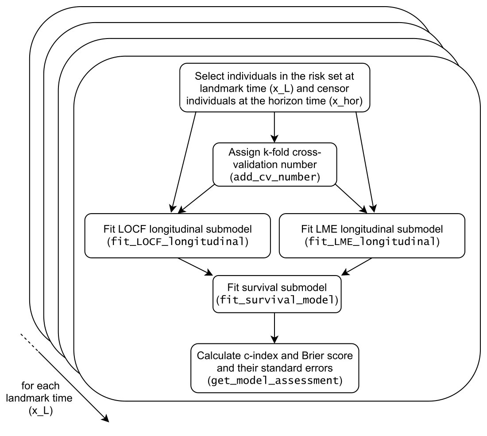

```{r, include = FALSE}
knitr::opts_chunk$set(
  collapse = TRUE,
  comment = "#>"
)
```

## Diagram of the functions `fit_LOCF_landmark` and `fit_LME_landmark`

Here is a diagram that represents the functions `fit_LOCF_landmark` (selecting option `fit_LOCF_longitudinal`) and `fit_LME_landmark` (selecting option `fit_LME_longitudinal`) to show how they are made up of their helper functions. All these functions are available with the R package Landmarking. 

```{r figurename, echo=FALSE, fig.cap="", out.width = '100%'}

```

The description of these functions are contained in `help()`.
